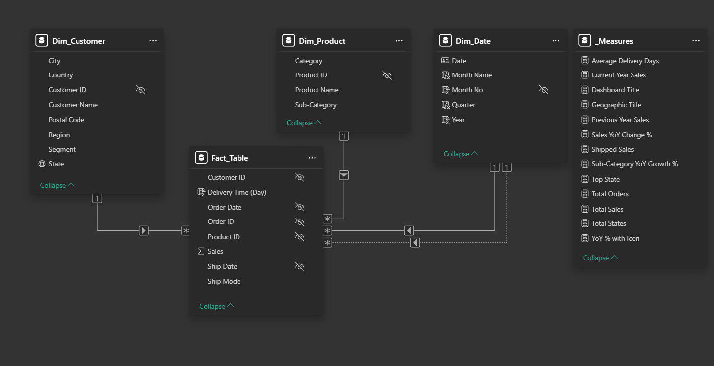
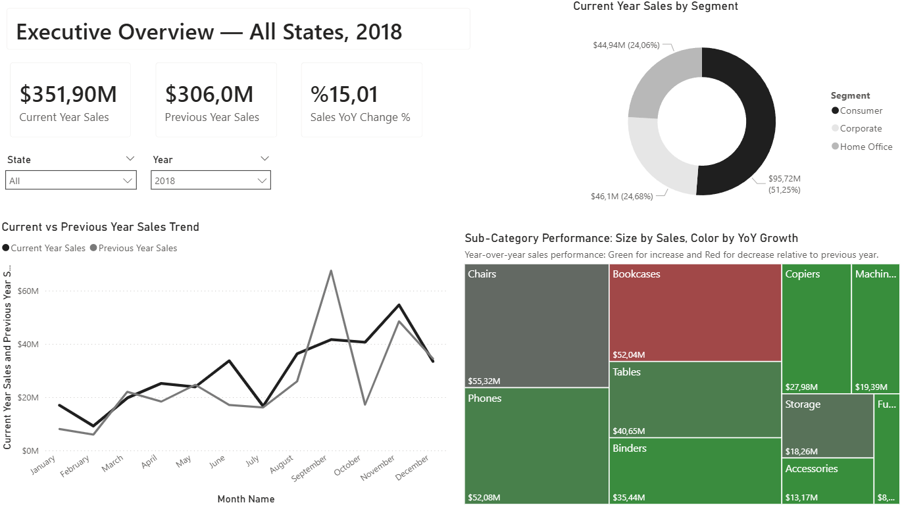
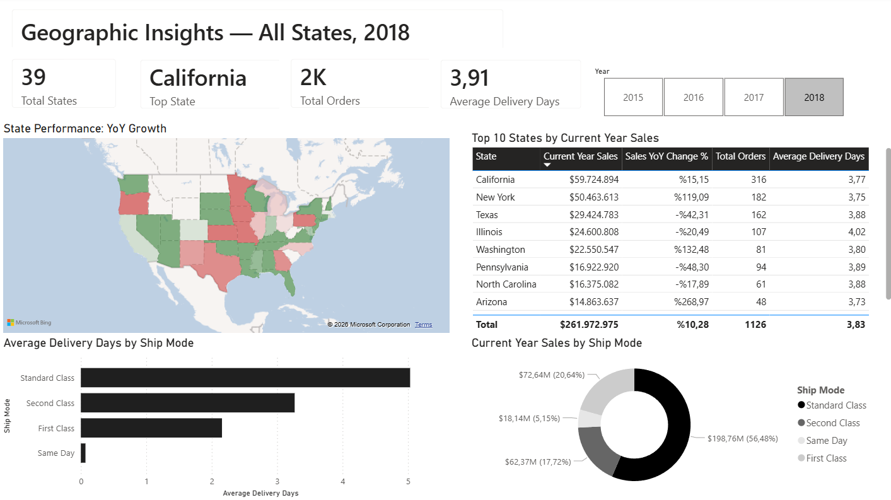

# Superstore Sales Dashboard

An interactive Power BI dashboard analyzing 3 years of Superstore sales data (2015-2018), built to demonstrate proficiency in DAX, data modeling, and dashboard design for executive decision-making.

## 📊 Project Overview

This dashboard transforms raw Superstore transactional data into actionable business intelligence across two analytical layers:

- **Executive Overview** — High-level KPIs, year-over-year trends, and category performance
- **Geographic Insights** — State-level performance, delivery metrics, and operational efficiency

The dashboard is fully interactive with synchronized slicers across both pages, allowing users to drill into specific years and states.

## 🛠️ Tech Stack

- **Power BI Desktop** — Dashboard development
- **DAX** — Custom measures for time intelligence and dynamic calculations
- **Star Schema Modeling** — Fact table with 4 dimension tables (Customer, Product, Date, Measures)
- **Power Query** — Data transformation and date table creation

## 🗂️ Data Model

The dashboard is built on a star schema with one fact table and four dimension tables:

- **Fact_Table** — Order-level transactions (Sales, Order Date, Ship Date, Delivery Time)
- **Dim_Customer** — Customer attributes (Segment, City, State, Region)
- **Dim_Product** — Product hierarchy (Category, Sub-Category, Product Name)
- **Dim_Date** — Date dimension for time intelligence (Year, Quarter, Month)
- **_Measures** — Centralized table for all calculated DAX measures

## 🎯 Key Features

### Executive Overview Page
- **Dynamic KPI cards** — Current Year Sales, Previous Year Sales, YoY Change %
- **Sales trend** — Monthly comparison between selected year and previous year
- **Customer segment breakdown** — Sales distribution across Consumer, Corporate, Home Office
- **Sub-category performance treemap** — Size by sales volume, color by YoY growth (green = growth, red = decline)

### Geographic Insights Page
- **U.S. filled map** — State-level YoY growth visualization with red/green gradient
- **Top 10 states table** — Sales, growth %, order count, and delivery time
- **Ship mode analysis** — Sales distribution and average delivery days by shipping class

### Cross-page Functionality
- Synchronized year and state slicers across both pages
- Dynamic page titles reflecting current filter context
- 2019 data excluded due to incomplete records (data quality decision)

## 💡 Key Insights

After exploring the data through this dashboard, three findings stood out:

**1. High-revenue states are losing momentum while emerging markets surge.** California, the largest market at $60M, grew only +15% YoY in 2018, while Arizona (+269%) and Washington (+132%) showed explosive growth. Resource allocation may need to shift toward these high-growth states.

**2. Revenue size does not equal category health.** Bookcases generated $198M in total sales but showed negative YoY growth — a signal that this category may be facing pricing pressure or competition. Treemap visualization (size + color encoding) made this misalignment immediately visible.

**3. Consumer segment dominates at 54%.** The customer base is heavily B2C (Consumer: $72M), with Corporate at 29% and Home Office at 16%. This validates a consumer-focused marketing strategy while highlighting Corporate as a potential growth segment.

## 📷 Screenshots

### Executive Overview — 2018

### Geographic Insights — 2018

## 🚀 How to Use

1. Download the `.pbix` file
2. Open with Power BI Desktop (free download from Microsoft)
3. Use the year and state slicers to filter the analysis
4. Hover over visuals for detailed tooltips

## 📝 Design Decisions

A few design choices worth noting:

- **Monochromatic color palette** with red/green only for performance signals — reduces visual noise and emphasizes meaningful comparisons
- **Filled map over bubble map** — better readability for small states (Delaware, Rhode Island) and consistent with the overall grayscale design language
- **Donut chart over pie chart** — center space available for potential KPI overlay, considered more modern in executive dashboards
- **Top 10 limit** on the states table — focuses attention on key markets without overwhelming the user
- **2019 excluded** — incomplete data in the dataset would mislead YoY comparisons

## 📚 Skills Demonstrated

- DAX time intelligence and dynamic measures
- Star schema data modeling
- Power BI visualization best practices
- Conditional formatting for analytical depth
- Cross-page slicer synchronization
- Dashboard design with consistent visual hierarchy

*Dataset: Sample Superstore (Tableau / Power BI demo dataset, U.S. retail sales 2015-2018)*
